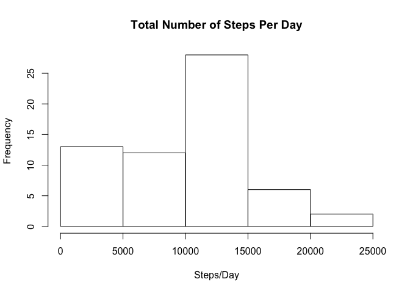
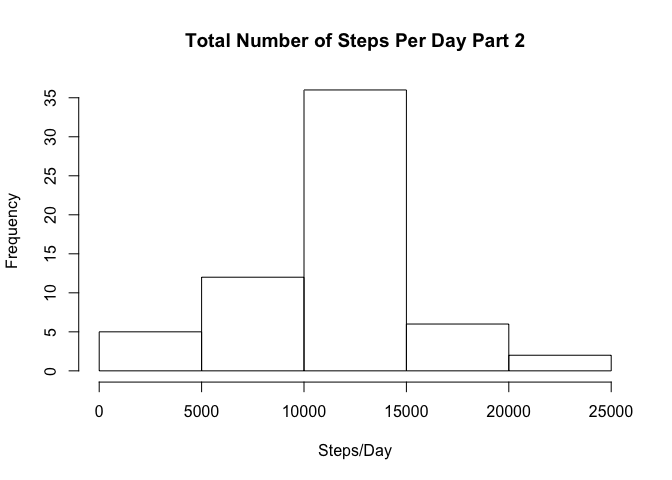
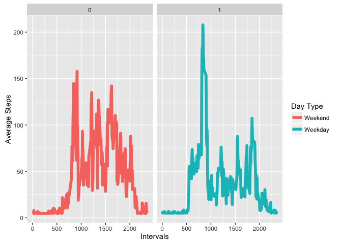

# Reproducible Research: Peer Assessment 1
Scott Roberts  

## Loading and preprocessing the data

```r
library(knitr)
library(ggplot2)
```

```
## Warning: package 'ggplot2' was built under R version 3.2.4
```

```r
library(stats)
## Create a variable to store the dataframe and change the dat format
activity <- (read.csv("activity.csv"))
activity$date <- strptime(activity$date, "%m/%d/%y")
```

## What is mean total number of steps taken per day?

```r
### Sum the Steps column
steps <- tapply(activity$steps,as.Date(activity$date), sum, na.rm=TRUE)
mean(steps, na.rm=TRUE)
```

```
## [1] 9354.23
```

```r
median(steps, na.rm=TRUE)
```

```
## [1] 10395
```

```r
hist(steps, main="Total Number of Steps Per Day", xlab='Steps/Day')
```



## What is the average daily activity pattern?

```r
##Compute the average from the interval column
avgsteps<-aggregate(steps~interval, data= activity, FUN="mean", na.rm=TRUE)

###Plot the timeseries
plot(avgsteps$interval,avgsteps$steps, type = "l", xlab="Interval", ylab="Average Steps")
```


## Imputing missing values


```r
###How many missing values in dataset
sum(is.na(activity))
```

```
## [1] 2304
```

```r
###Create a new dataset that is equal to the original dataset but with the missing data using average steps
activity$steps[is.na(activity$steps)] <-mean(avgsteps$steps)

modactivity <-activity
# Repeat the Steps for Steps per Day
steps2 <- tapply(modactivity$steps,as.Date(modactivity$date), sum, na.rm=TRUE)
mean(steps2, na.rm=TRUE)
```

```
## [1] 10766.19
```

```r
median(steps2, na.rm=TRUE)
```

```
## [1] 10766.19
```

```r
hist(steps2, main="Total Number of Steps Per Day Part 2", xlab='Steps/Day')
```



```r
## The values are quite different from the first run against the data
```

## Are there differences in activity patterns between weekdays and weekends?

```r
###Create another factor for day of the week
modactivity$daytype <- weekdays(modactivity$date)
modactivity$weekday <-  ifelse(modactivity$daytype %in% c("Monday","Tuesday","Wednesday","Thursday","Friday"),1,0)

###Plot a time series for weekday and weekend

avgsteps2 <-aggregate(steps~interval+weekday, data= modactivity, FUN="mean", na.rm=TRUE)

###Plot the timeseries panel with Weekend and WeekDays side by side
ggsteps <- ggplot(aes(interval,steps), data= avgsteps2,  fill="Experimental Condition")
ggsteps +facet_grid(.~weekday)+geom_line(size=2,aes(color=factor(weekday))) + labs(x="Intervals",y="Average Steps")+ scale_colour_hue(name = "Day Type", labels=c("Weekend","Weekday"))
```


